# Pensieve MCP Architecture

## 전체 시스템 아키텍처

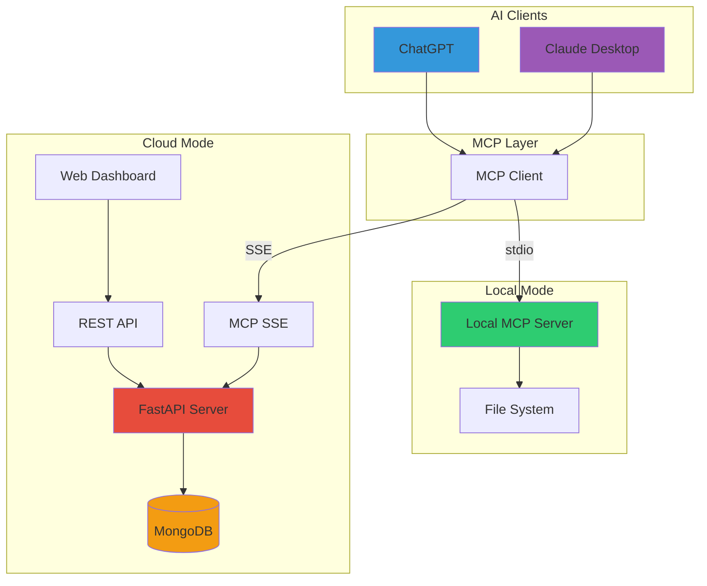

## 데이터 흐름

### 1. Local Mode 데이터 흐름

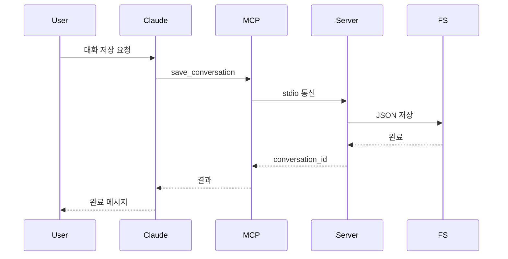

### 2. Cloud Mode 데이터 흐름 (인증)

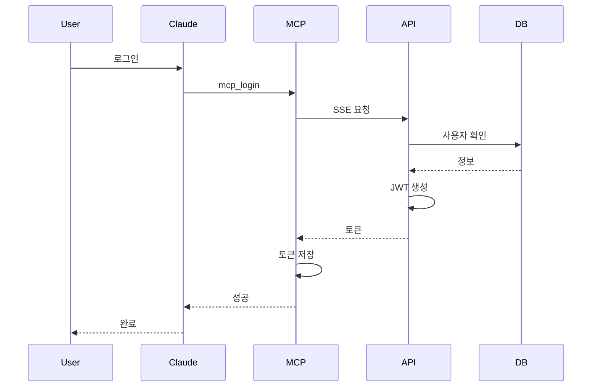

### 3. Cloud Mode 데이터 흐름 (대화 저장)

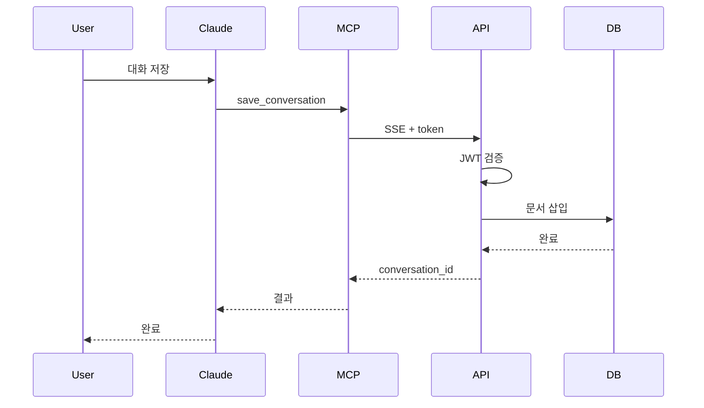

## 컴포넌트 상세 구조

### MCP Server (Local)

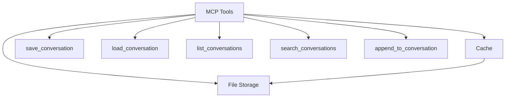

### API Server (Cloud)

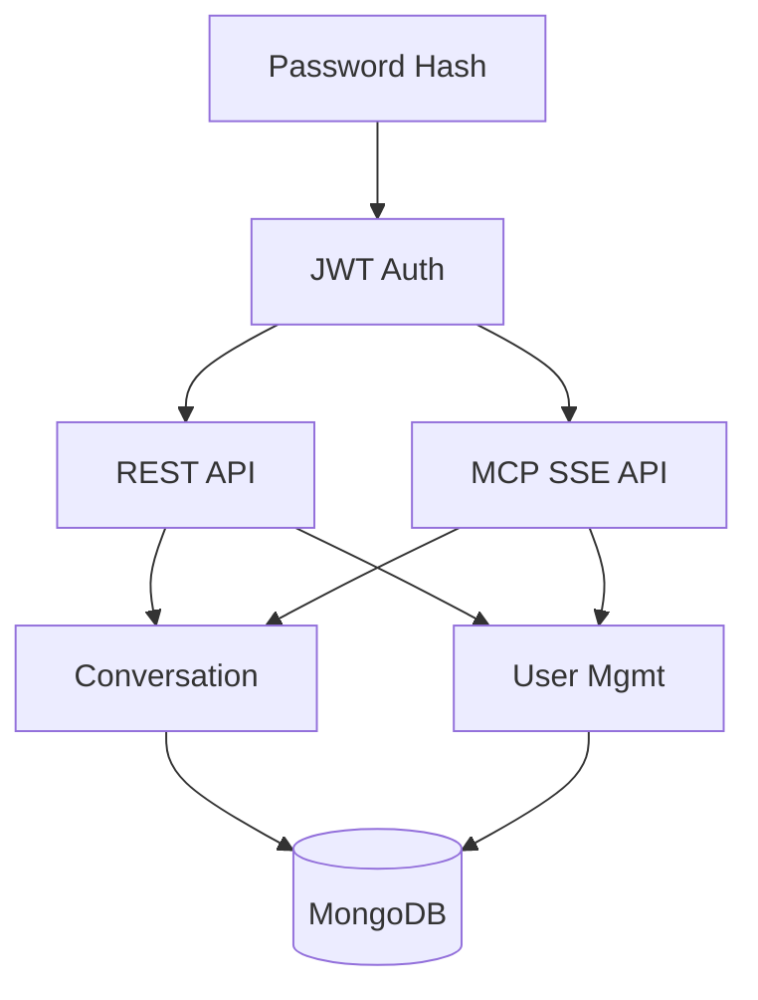

### 데이터 모델

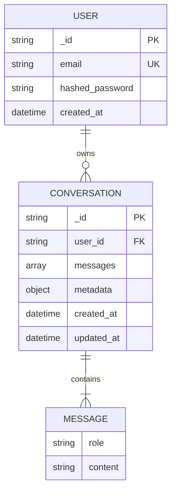

## 배포 아키텍처 (Azure)

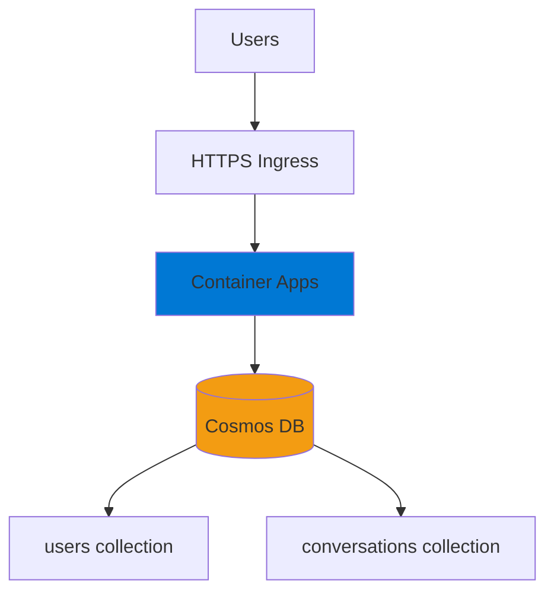

## 통신 프로토콜

### 1. MCP stdio Protocol (Local)

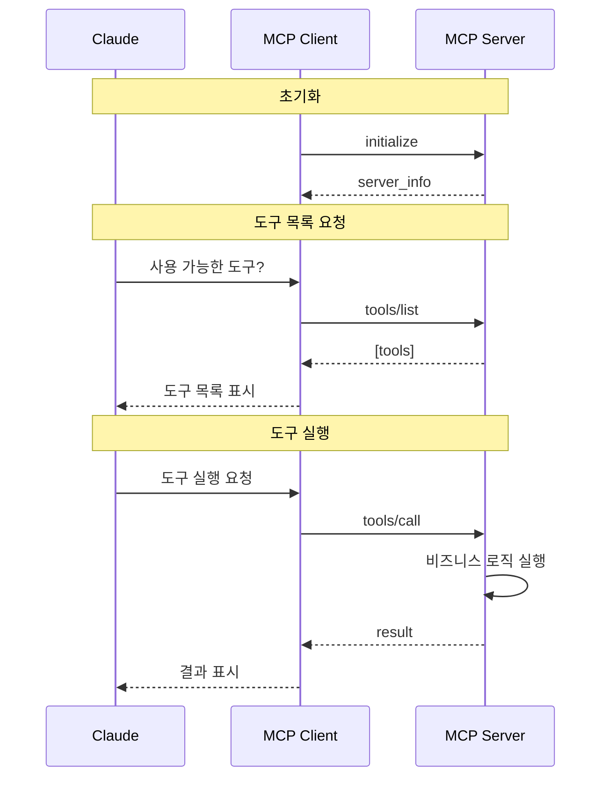

### 2. MCP SSE Protocol (Cloud)

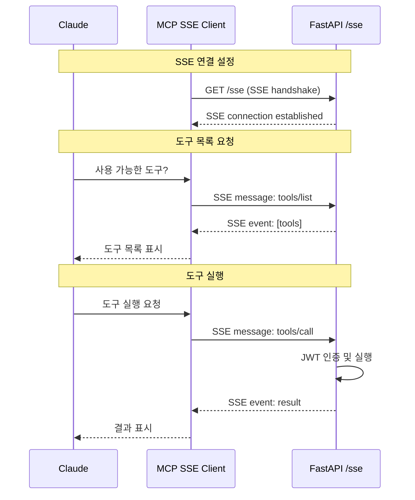

## 보안 아키텍처

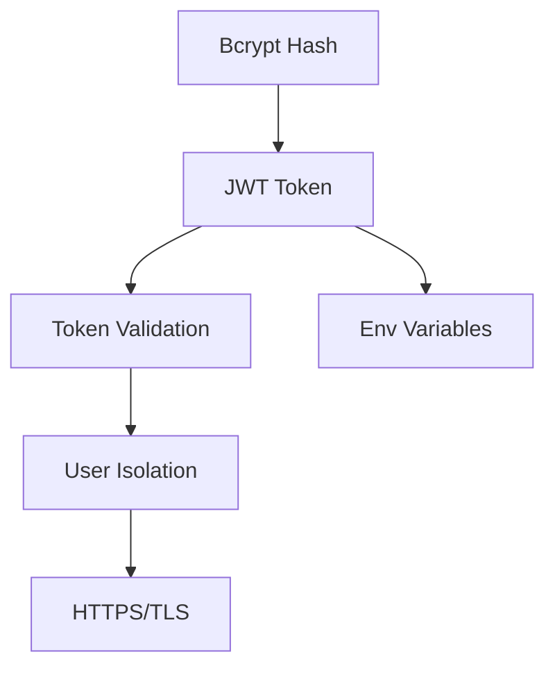

## 주요 특징

### 1. **Dual Mode Architecture**
- **Local Mode**: 파일 시스템 기반, 빠른 응답, 단일 사용자
- **Cloud Mode**: MongoDB 기반, 멀티 유저, 어디서나 접근

### 2. **MCP Protocol Support**
- **stdio**: Local mode, Claude Desktop 네이티브 통합
- **SSE**: Cloud mode, HTTP 기반 실시간 통신

### 3. **Security**
- JWT 토큰 기반 인증
- Bcrypt 비밀번호 해싱
- 사용자별 데이터 격리

### 4. **Scalability**
- Azure Container Apps 자동 스케일링
- Cosmos DB 글로벌 분산
- 캐싱 메커니즘 (Local mode)

### 5. **User Experience**
- Web Dashboard for conversation management
- Setup guides for easy configuration
- RESTful API for external integrations
