# Pensieve MCP - Cloud Architecture

## 전체 시스템 아키텍처

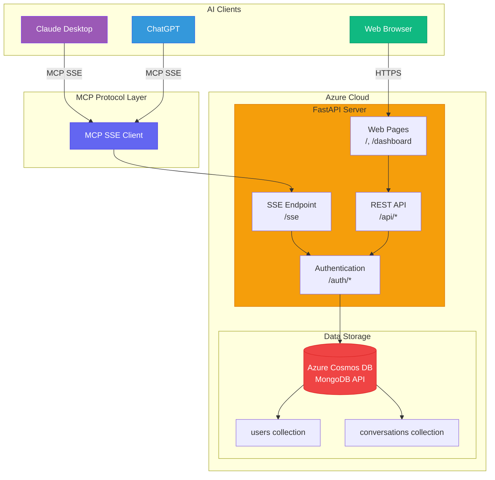

## 클라이언트별 접근 방식

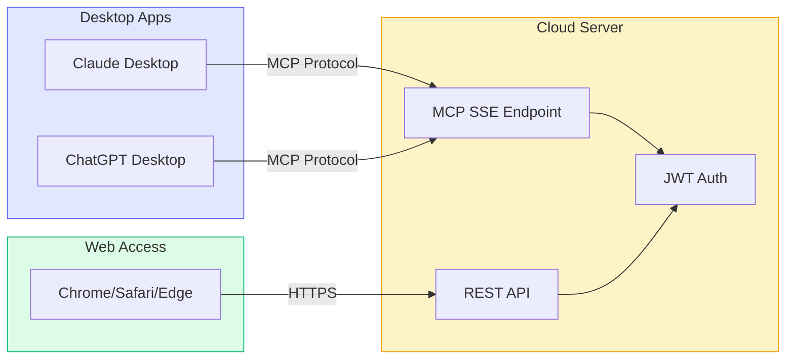

## 데이터 흐름 - 회원가입/로그인

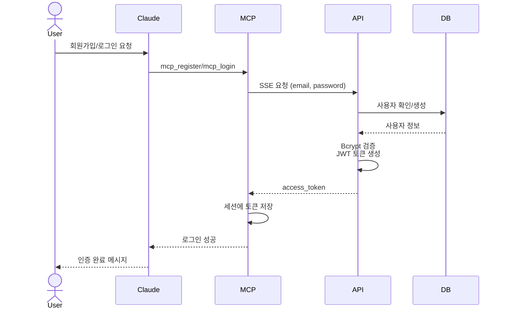

## 데이터 흐름 - 대화 저장

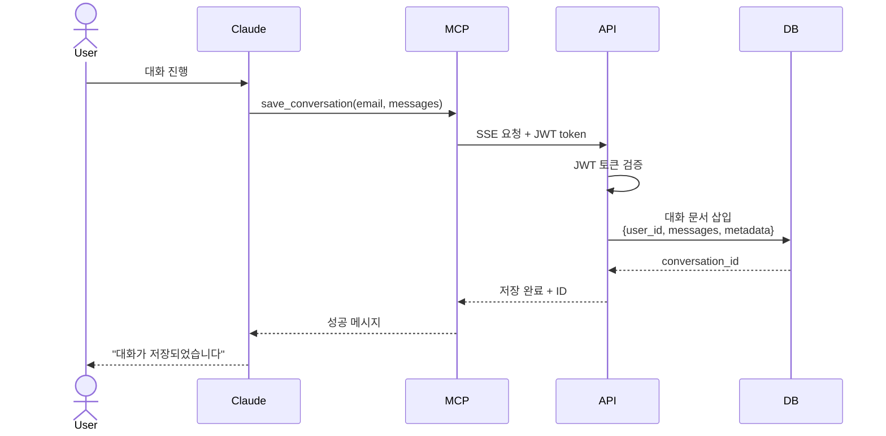

## 데이터 흐름 - 대화 불러오기

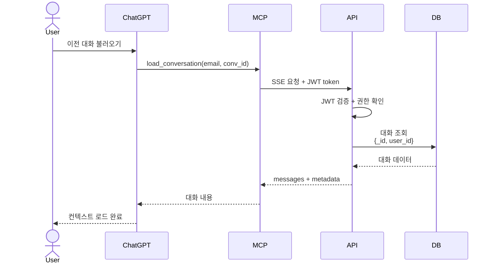

## API Server 아키텍처

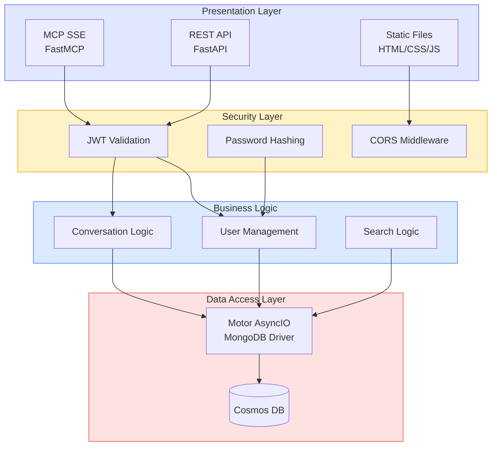

## MCP Tools (사용 가능한 기능)

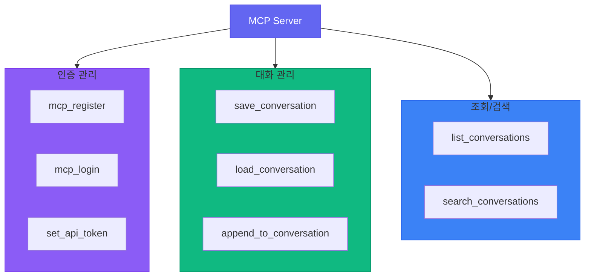

## 데이터 모델

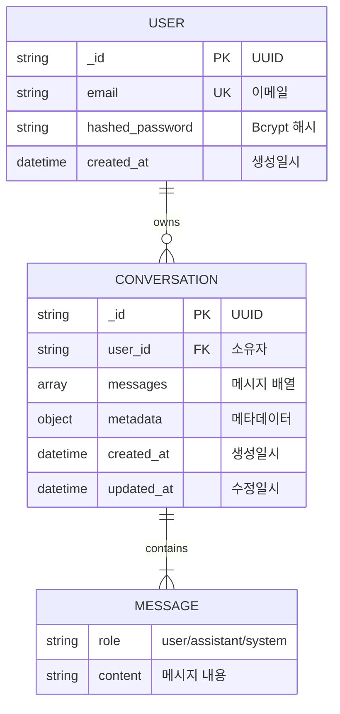

## Azure 배포 아키텍처

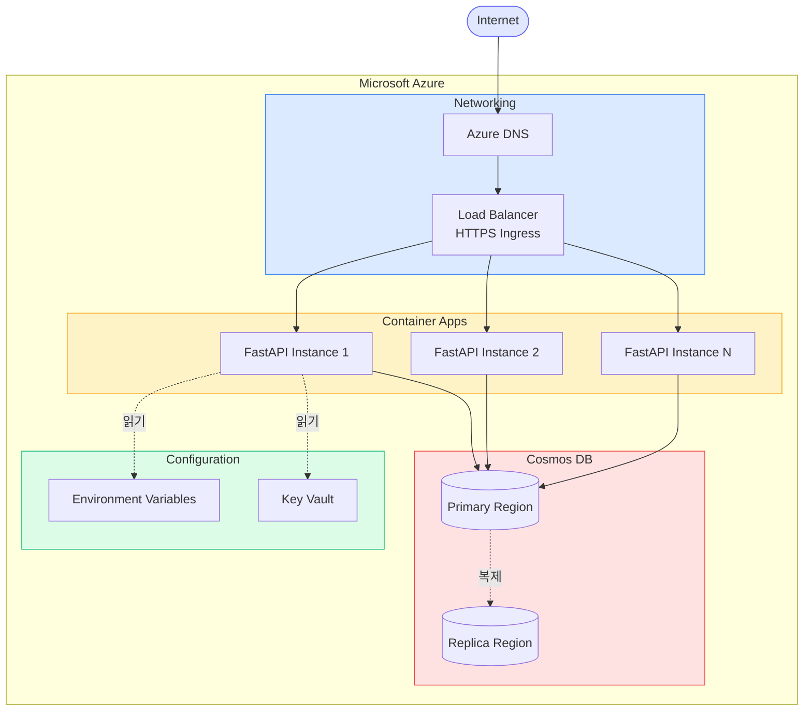

## 보안 아키텍처

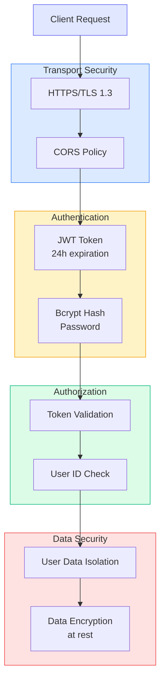

## 멀티 유저 격리

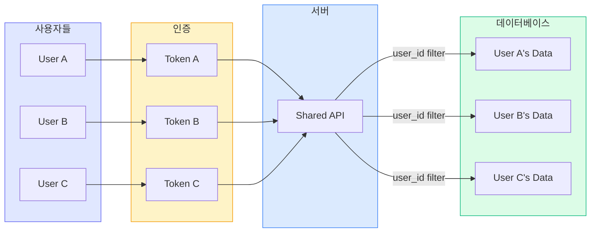

## 사용자 여정

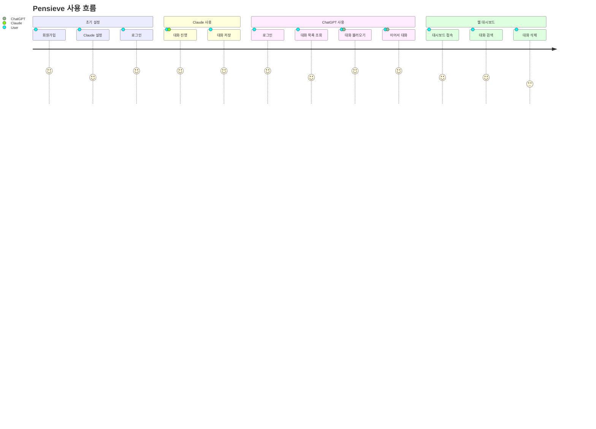

## 기술 스택

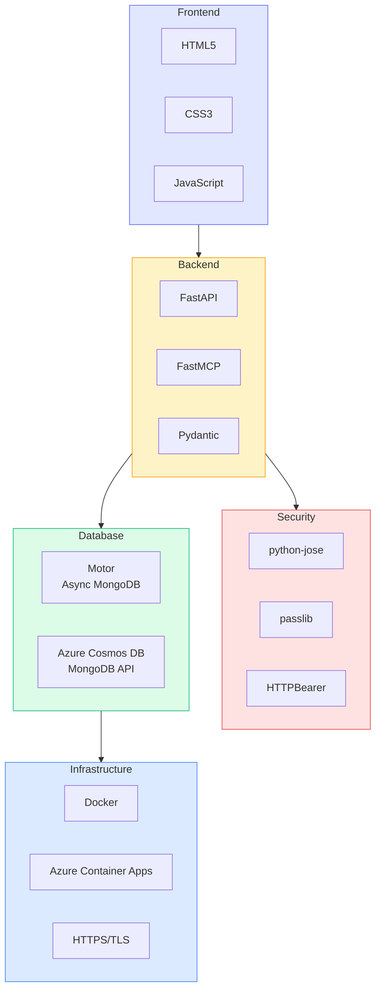

## 핵심 특징

### 1. **클라우드 네이티브**
- Azure Container Apps 완전 관리형
- 자동 스케일링 (0 → N instances)
- 글로벌 배포 가능

### 2. **멀티 유저 지원**
- JWT 기반 인증
- 사용자별 데이터 완전 격리
- Bcrypt 암호화

### 3. **Cross-Platform**
- Claude Desktop (MCP SSE)
- ChatGPT (MCP SSE)
- Web Dashboard (REST API)

### 4. **보안**
- HTTPS/TLS 암호화
- JWT 토큰 인증 (24시간)
- 사용자별 권한 검증
- CORS 정책

### 5. **확장성**
- Azure Cosmos DB 글로벌 분산
- Container Apps 자동 스케일
- 비동기 I/O (AsyncIO)
- MongoDB 인덱싱
