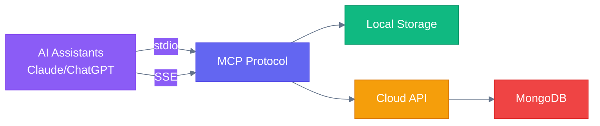
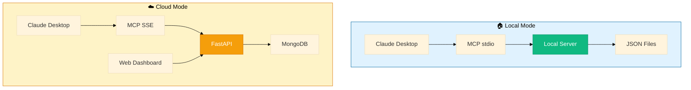
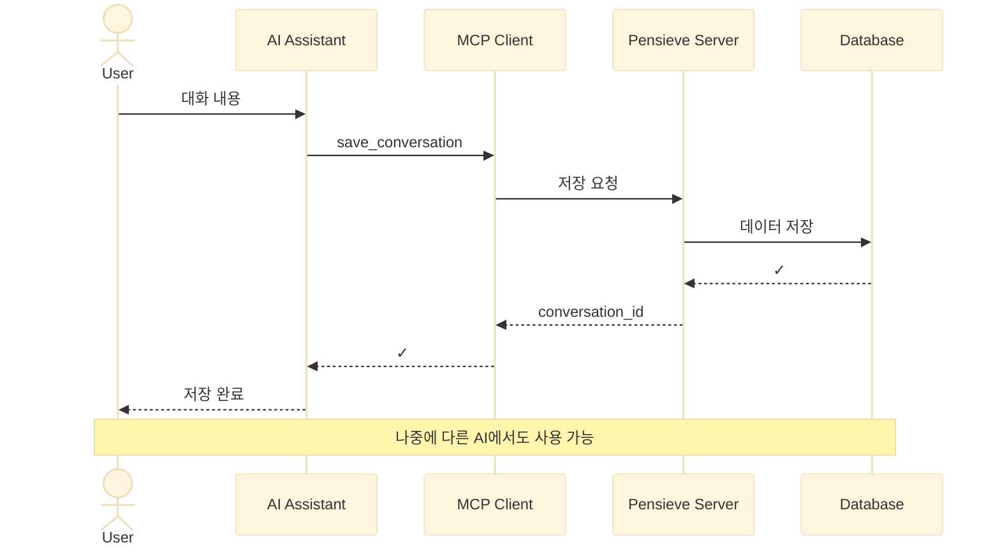
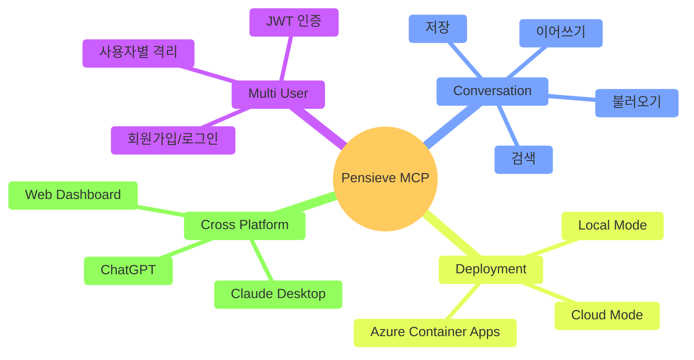
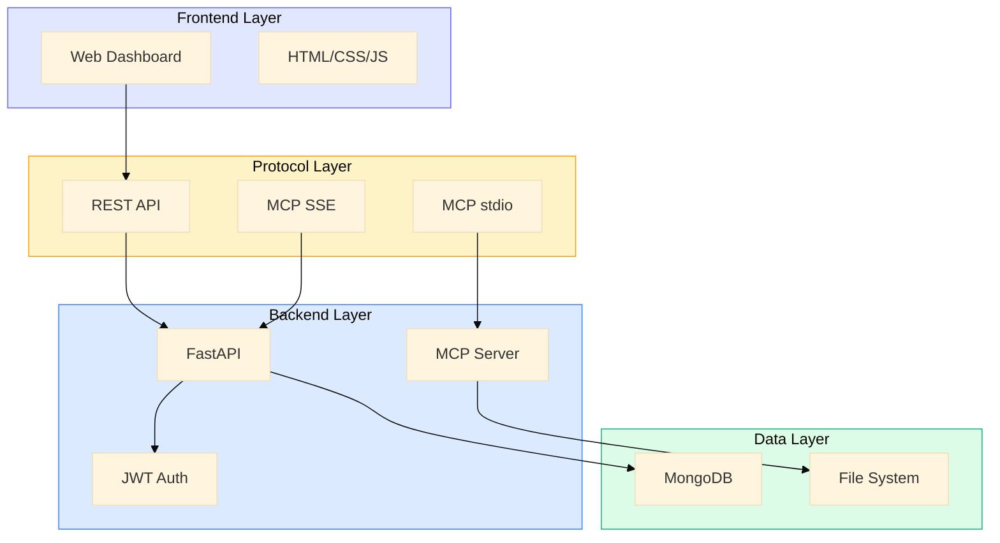
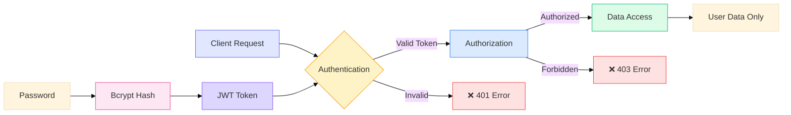
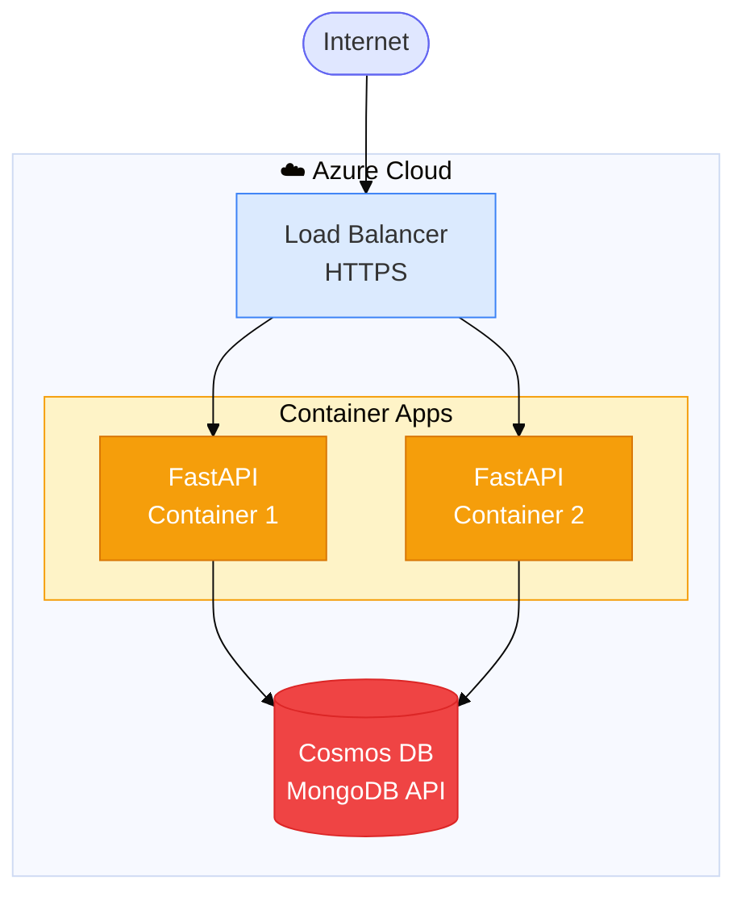
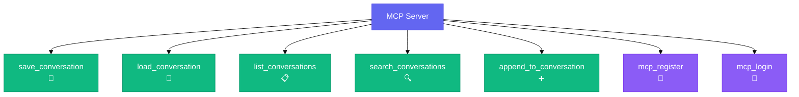
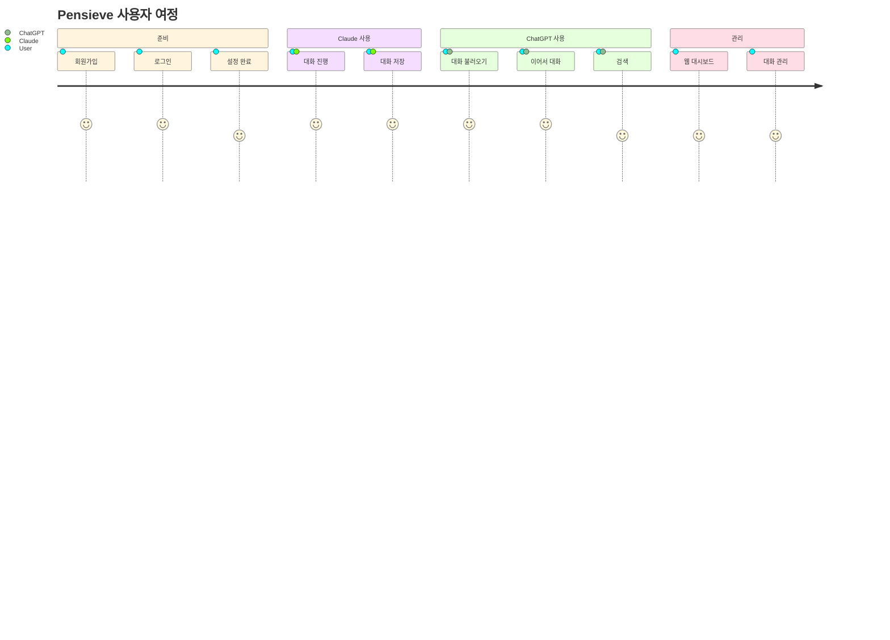
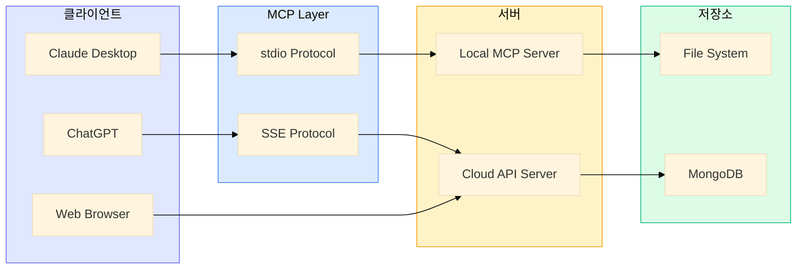

# Pensieve MCP - PPT용 아키텍처 다이어그램

## 1. 시스템 개요 (High-Level Architecture)



## 2. 아키텍처 비교 (Local vs Cloud)



## 3. 데이터 흐름 (간단 버전)



## 4. 핵심 기능 (Feature Overview)



## 5. 기술 스택



## 6. 보안 구조



## 7. 배포 아키텍처 (Azure)



## 8. MCP Tools 구조



## 9. 사용 시나리오



## 10. 시스템 구성요소



---

## 🎨 PPT 작성 팁

### 추천 다이어그램 순서:
1. **슬라이드 1**: 시스템 개요 (#1)
2. **슬라이드 2**: Local vs Cloud 비교 (#2)
3. **슬라이드 3**: 데이터 흐름 (#3)
4. **슬라이드 4**: 핵심 기능 (#4)
5. **슬라이드 5**: 기술 스택 (#5)
6. **슬라이드 6**: Azure 배포 (#7)

### Mermaid를 이미지로 변환하는 방법:

#### 방법 1: Mermaid Live Editor
1. https://mermaid.live 접속
2. 다이어그램 코드 복사/붙여넣기
3. PNG/SVG로 다운로드

#### 방법 2: VS Code Extension
1. "Markdown Preview Mermaid Support" 설치
2. 미리보기에서 우클릭 → 이미지로 저장

#### 방법 3: CLI 도구
```bash
npm install -g @mermaid-js/mermaid-cli
mmdc -i diagram.md -o output.png
```

### 색상 팔레트:
- 🟣 Purple: #8b5cf6 (AI/Client)
- 🔵 Blue: #6366f1 (MCP Protocol)
- 🟢 Green: #10b981 (Local/Storage)
- 🟡 Orange: #f59e0b (API/Cloud)
- 🔴 Red: #ef4444 (Database)
