# Pensieve MCP - 간단한 클라우드 아키텍처

## 전체 시스템 아키텍처

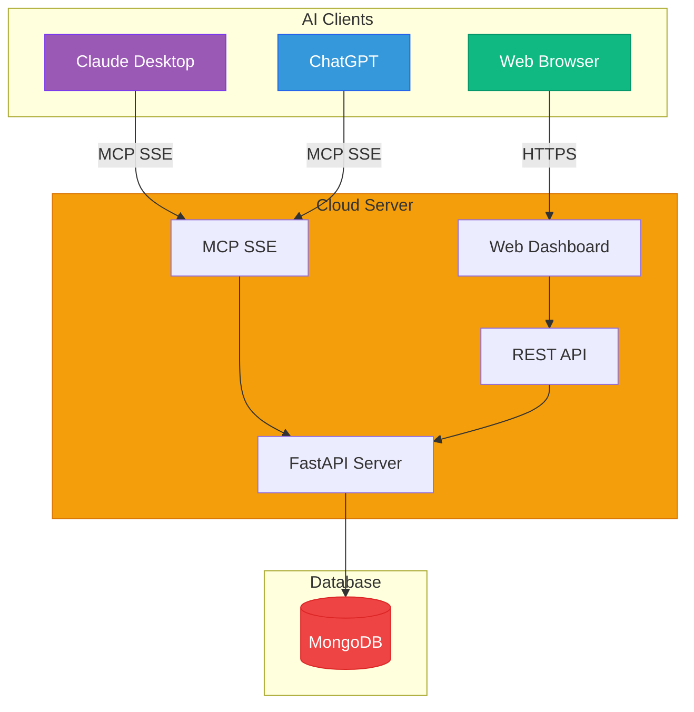

## 시스템 개요 (PPT용)

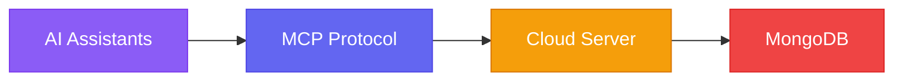

## 클라이언트별 접근 방식

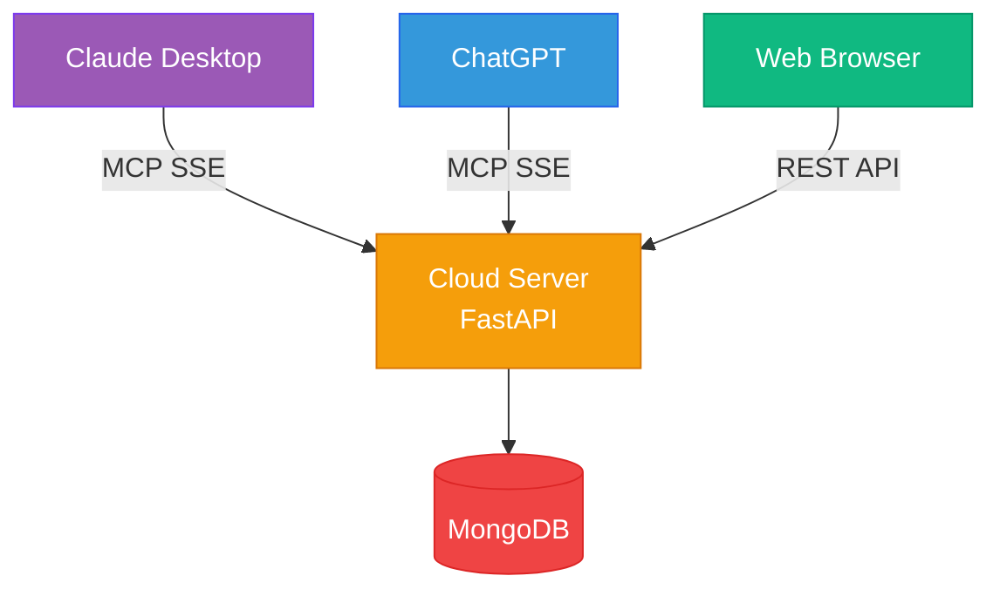

## 데이터 흐름 - 회원가입/로그인

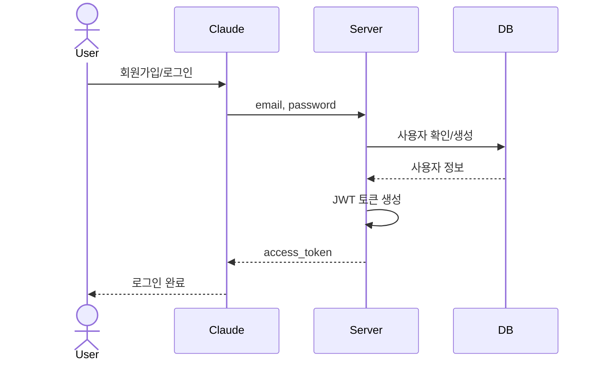

## 데이터 흐름 - 대화 저장

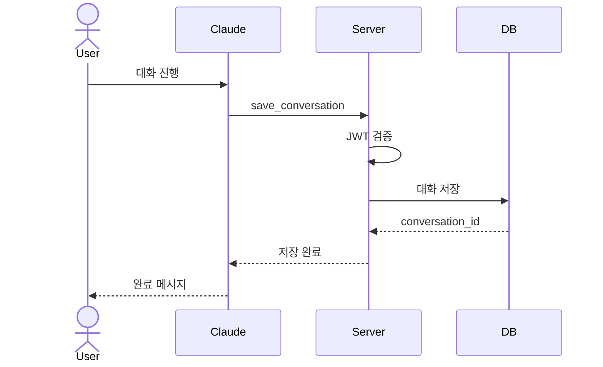

## 데이터 흐름 - 대화 불러오기

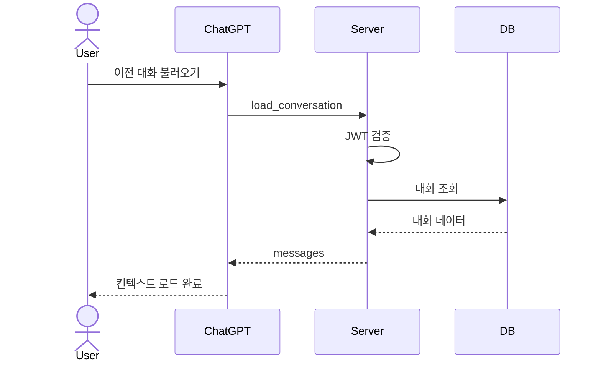

## 서버 구조

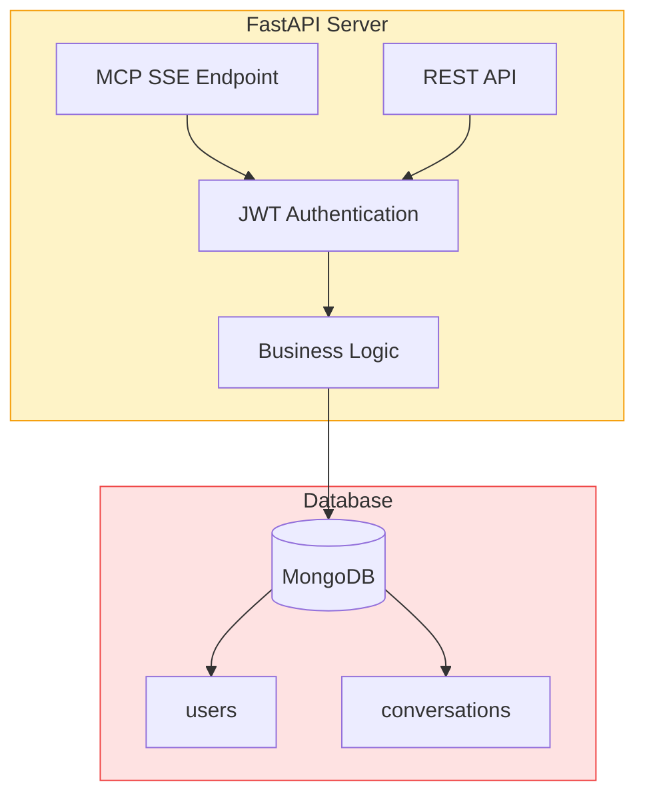

## MCP Tools (제공 기능)

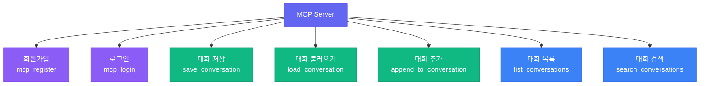

## 데이터 모델

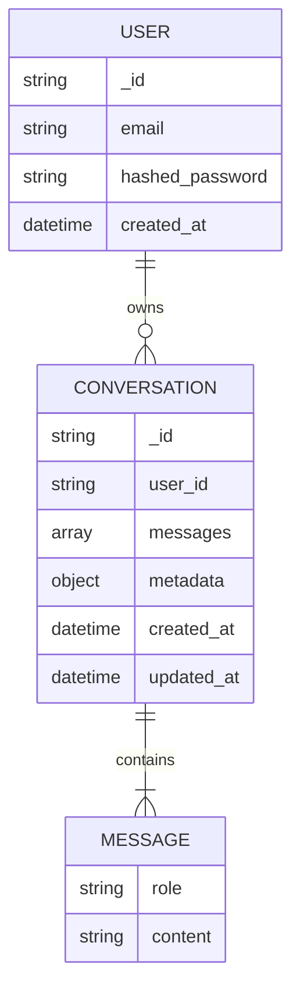

## 보안 구조

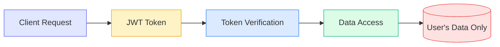

## 멀티 유저 격리

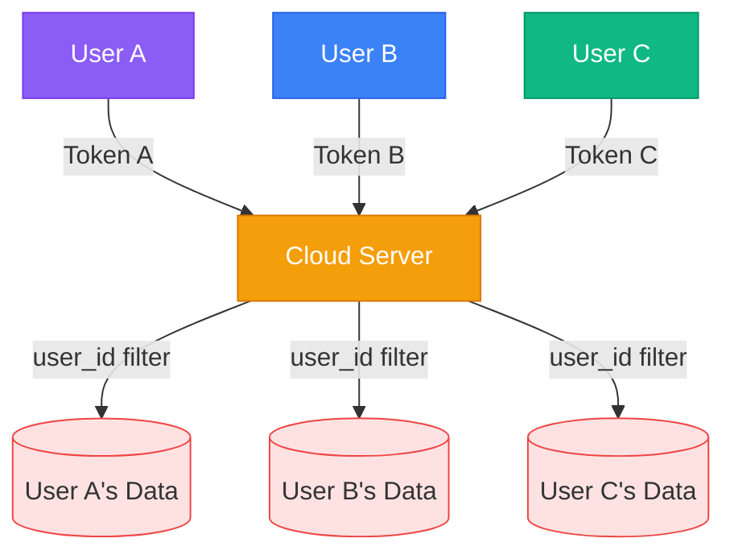

## 배포 구조

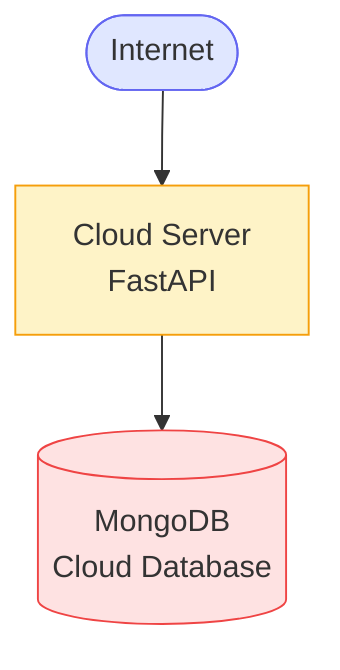

## 기술 스택

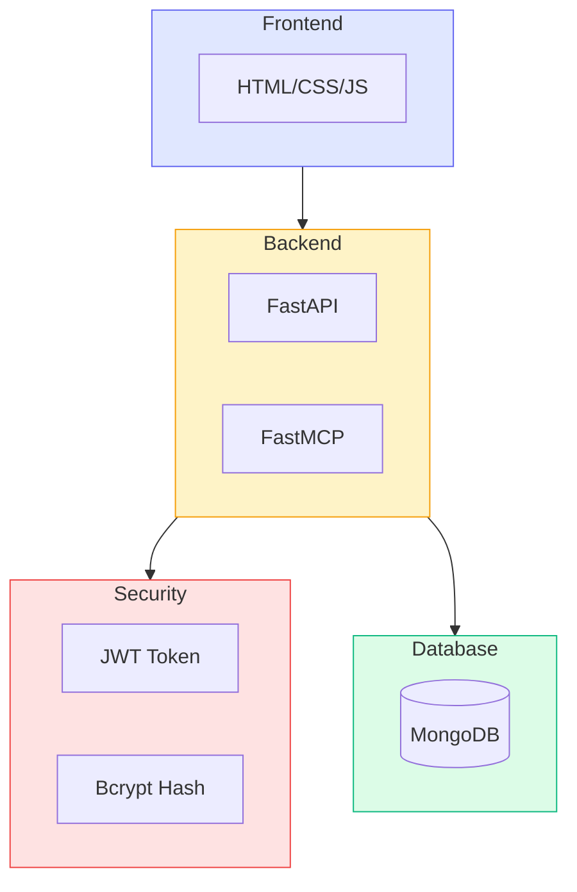

## 사용자 여정

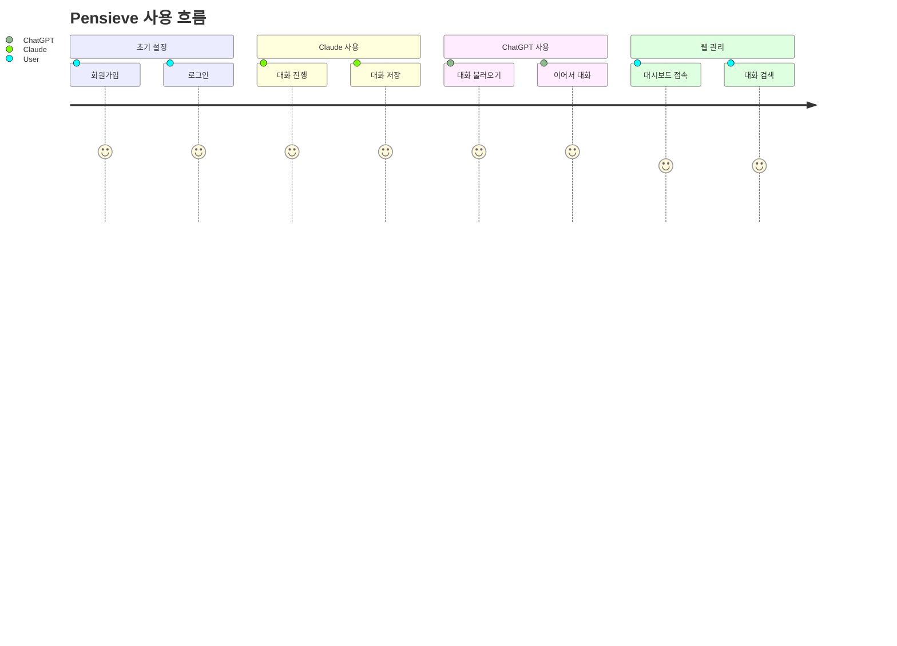

## 핵심 기능

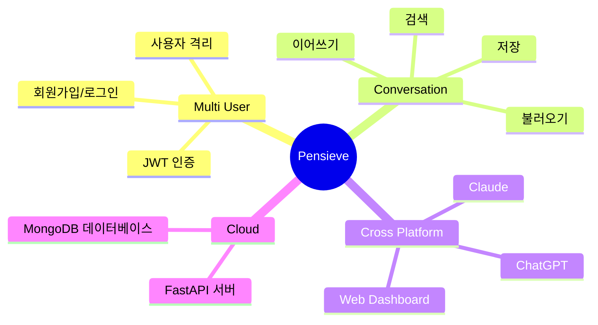

## 주요 특징

### 1. **멀티 유저 지원**
- JWT 토큰 기반 인증
- 사용자별 데이터 완전 격리
- Bcrypt 비밀번호 암호화

### 2. **Cross-Platform**
- Claude Desktop (MCP SSE)
- ChatGPT (MCP SSE)
- Web Dashboard (REST API)

### 3. **간단한 클라우드 구조**
- FastAPI 서버
- MongoDB 데이터베이스
- HTTPS 암호화 통신

### 4. **보안**
- JWT 토큰 인증 (24시간)
- 사용자별 권한 검증
- 비밀번호 해싱

---

## 🎨 PPT 추천 슬라이드

1. **시스템 개요** - 4개 블록 다이어그램
2. **클라이언트별 접근** - 3가지 사용 방식
3. **데이터 흐름** - 대화 저장/불러오기
4. **MCP Tools** - 제공하는 기능들
5. **멀티 유저 격리** - 보안 구조
6. **기술 스택** - 사용 기술
